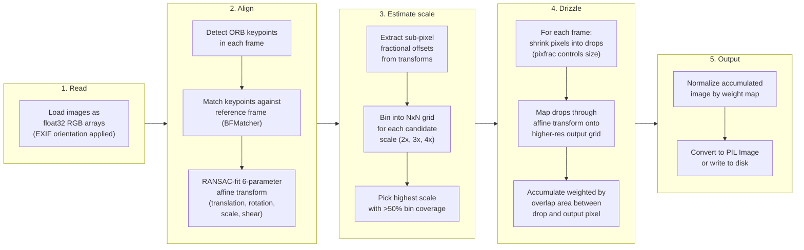
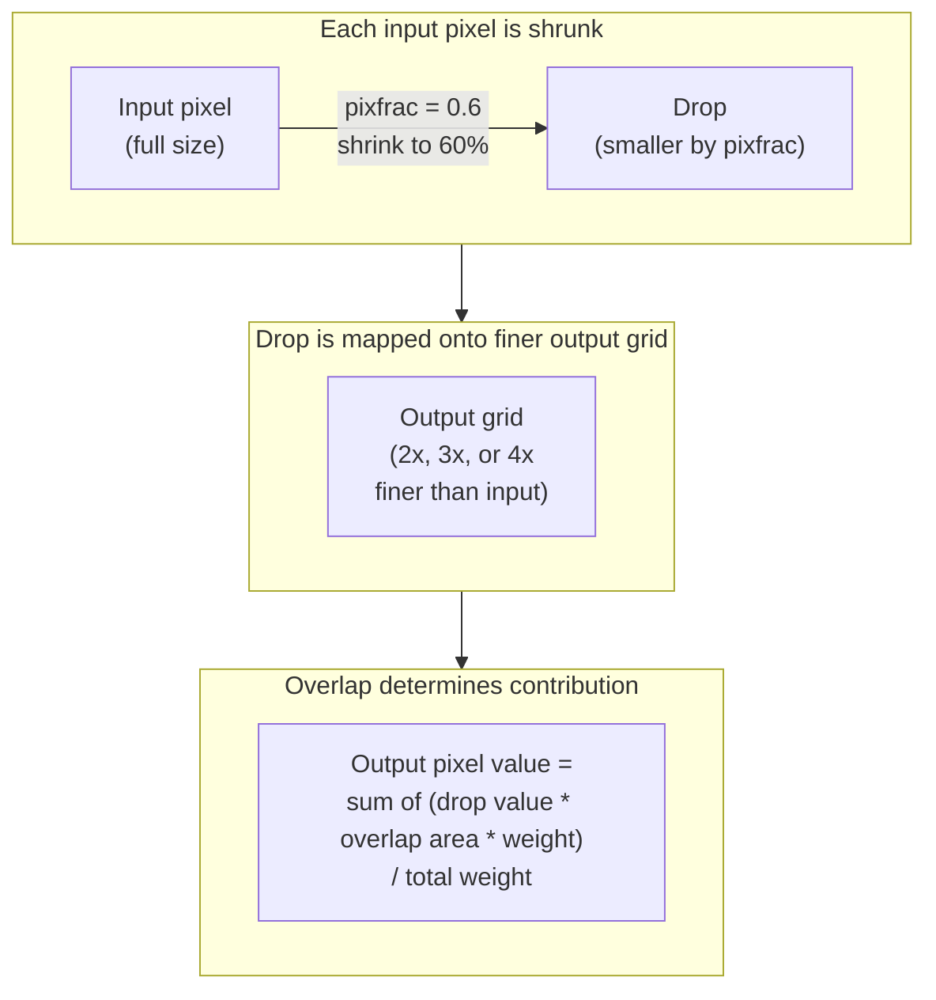

# superdrizzle

Combine multiple dithered images into a higher-resolution output using the
Fruchter & Hook (2002) [Variable-Pixel Linear Reconstruction](https://arxiv.org/abs/astro-ph/9808087)
algorithm.

Works with handheld photo bursts, astrophotography, drone/satellite imagery,
or any set of images with sub-pixel offsets between frames.

## Install

From PyPI:

```bash
pip install superdrizzle
```

Or with [uv](https://docs.astral.sh/uv/):

```bash
uv add superdrizzle
```

From GitHub:

```bash
pip install git+https://github.com/travcunn/superdrizzle.git
# or
uv add git+https://github.com/travcunn/superdrizzle.git
```

For development:

```bash
git clone https://github.com/travcunn/superdrizzle.git
cd superdrizzle
uv sync
```

## Quick Start

```python
import superdrizzle

result = superdrizzle.drizzle(["frame1.jpg", "frame2.jpg", "frame3.jpg"])
result.save("output.png")
```

That's it. Frames are auto-aligned, the scale factor is estimated from the
dither pattern, and you get back a PIL Image.

## CLI

```bash
superdrizzle frame*.jpg -o output.png
```

### Options

| Flag | Description | Default |
|------|-------------|---------|
| `-o, --output` | Output image path | required |
| `-s, --scale` | Force output scale factor (e.g. 2, 3) | auto |
| `-p, --pixfrac` | Drop shrink factor (0.0-1.0) | 0.6 |
| `--weights` | Also write a weight map | off |
| `--ref` | Index of reference frame | 0 |
| `--no-progress` | Disable progress bar | off |

## API

### One-liner

```python
import superdrizzle

# From file paths
result = superdrizzle.drizzle(["frame1.jpg", "frame2.jpg"])
result.save("output.png")

# From PIL Images
result = superdrizzle.drizzle([pil_img1, pil_img2])
result.save("output.png")

# From numpy arrays
result = superdrizzle.drizzle(numpy_arrays)
result.save("output.png")

# With options
result = superdrizzle.drizzle(images, scale=3, pixfrac=0.4)
result.save("output_3x.png")
```

### Pipeline (when you want intermediate results)

```python
from superdrizzle import Pipeline

pipe = Pipeline(["frame1.jpg", "frame2.jpg", "frame3.jpg"])

pipe.transforms    # list of 2x3 affine matrices
pipe.scale         # auto-estimated scale factor
pipe.n_aligned     # how many frames aligned

result, weights = pipe.combine(scale=2, pixfrac=0.6)
result.save("output.png")  # PIL Image
```

### Bare functions (full control)

```python
from superdrizzle import (
    load, compute_transforms, estimate_scale, drizzle_combine, to_pil
)

images = [load(p) for p in paths]          # flexible input -> float32 numpy
transforms = compute_transforms(images)     # ORB + RANSAC affine
scale = estimate_scale(transforms)          # from sub-pixel coverage
result, weights = drizzle_combine(          # area-weighted drops
    images, transforms, scale=scale, pixfrac=0.6
)
pil_image = to_pil(result)                 # numpy -> PIL
pil_image.save("output.png")
```

### Input types

`superdrizzle.load()` and all high-level functions accept:

- `str` or `pathlib.Path` (file paths)
- File objects with `.read()` (binary streams)
- `PIL.Image.Image`
- `numpy.ndarray` (uint8 or float32)

## How it works

### Pipeline



### The drizzle kernel

The core algorithm (step 4) is what makes this different from simple stacking.
When you shift-and-add images, you reconvolve with the detector's pixel
footprint, which blurs the result. Drizzle avoids this by shrinking each input
pixel into a smaller "drop" before mapping it onto the output grid:



Because the drop is smaller than the original pixel, it typically straddles
only 1-4 output pixels instead of covering a large area. This preserves the
high-frequency information that shift-and-add would blur away.

The `pixfrac` parameter controls the trade-off:

| pixfrac | Method | Resolution | S/N | When to use |
|---------|--------|------------|-----|-------------|
| 1.0 | shift-and-add | lowest | highest | many frames, don't need sharpness |
| 0.6 | drizzle (default) | good | good | most real-world data |
| 0.0 | interlacing | highest | lowest | perfectly placed dithers only |

## Dependencies

- numpy
- opencv-python
- Pillow

## Reference

Fruchter, A. S. & Hook, R. N. (2002). "Drizzle: A Method for the Linear
Reconstruction of Undersampled Images." PASP, 114, 144-152.
[arXiv:astro-ph/9808087](https://arxiv.org/abs/astro-ph/9808087)
